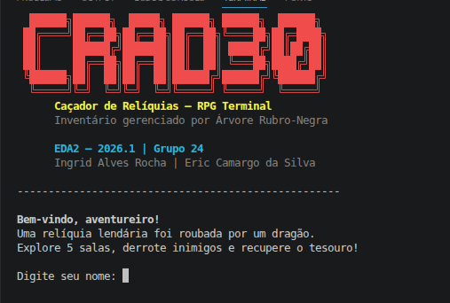
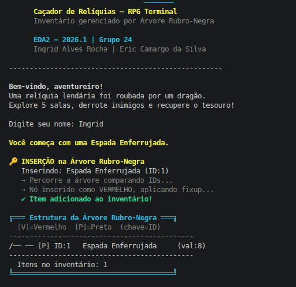
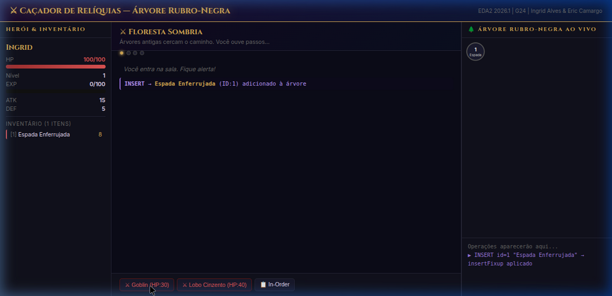
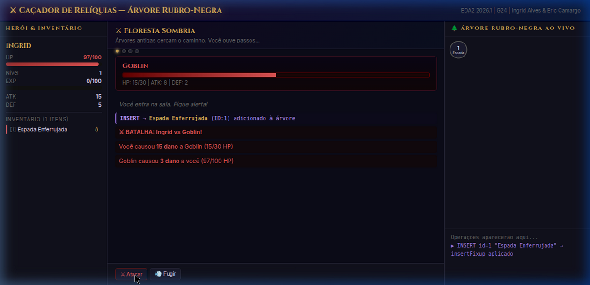

# 🗡️ Caçador de Relíquias — Árvore Rubro-Negra

RPG interativo que demonstra a **Árvore Rubro-Negra (Red-Black Tree)** na prática, disponível em **duas versões**: jogo de terminal (C) e jogo web (navegador).

Desenvolvido para a disciplina de **Estruturas de Dados e Algoritmos 2 (EDA2) – 2026.1**.

---

## Alunos

<div align="center">
<table>
  <tr>
    <td align="center"><a href="https://github.com/alvesingrid"><br/><sub><b>Ingrid Alves</b></sub></a></td>
    <td align="center"><a href="https://github.com/Ericcs10"><br/><sub><b>Eric Camargo</b></sub></a></td>
  </tr>
</table>
</div>

| Matrícula  | Nome                      |
|:-----------|:--------------------------|
| 202045348  | **Ingrid Alves Rocha**    |
| 202016168  | **Eric Camargo da Silva** |

---

## 🎮 Sobre o Projeto

**Caçador de Relíquias** é um RPG de dungeon onde o jogador explora 4 salas, derrota inimigos e coleta itens para recuperar uma relíquia lendária roubada por um dragão.

O diferencial acadêmico: **o inventário do jogador é uma Árvore Rubro-Negra**. Cada ação do jogo demonstra visualmente uma operação real na estrutura:

| Ação no Jogo         | Operação na Árvore RB              |
|----------------------|------------------------------------|
| Coletar item         | **INSERT** + `insertFixup`         |
| Usar poção           | **SEARCH** → **DELETE** + `deleteFixup` |
| Listar inventário    | **IN-ORDER** traversal (IDs crescentes) |
| Visualizar estrutura | **printTree** com cores Vermelho/Preto  |

---

## 🌲 A Árvore Rubro-Negra

Uma **BST auto-balanceada** que garante altura máxima $2\log_2(n+1)$.

### Propriedades mantidas

1. Todo nó é **VERMELHO** ou **PRETO**
2. A **raiz** é sempre **PRETA**
3. Toda **folha** (sentinela `nil`) é **PRETA**
4. Filho de nó **VERMELHO** é obrigatoriamente **PRETO**
5. Todo caminho raiz → folha contém o mesmo número de nós **PRETOS** (*black-height*)

### Complexidade

| Operação | Pior caso   |
|----------|-------------|
| Busca    | $O(\log n)$ |
| Inserção | $O(\log n)$ |
| Remoção  | $O(\log n)$ |

### Detalhes de Implementação

- **Nó sentinela `nil`**: único nó preto compartilhado como folha universal, eliminando verificações de ponteiro nulo
- **`leftRotate` / `rightRotate`**: mantêm a propriedade de BST durante os rebalanceamentos
- **`insertFixup`**: corrige 3 casos após inserção de nó VERMELHO (recolorir, rotação simples, rotação dupla)
- **`deleteFixup`**: corrige 4 casos de "nó duplamente preto" com rotações simétricas

---

## 🖥️ Versão Web (Recomendada)

Jogo completo rodando no navegador com **visualização ao vivo da árvore em SVG**.

### Como abrir

```bash
# Basta abrir o arquivo no navegador:
xdg-open index.html
# ou arraste o arquivo index.html para o navegador
```

### Interface

```
┌──────────────────┬───────────────────────────┬──────────────────────┐
│  Herói & Inv.    │       Arena do Jogo        │  🌲 Árvore ao Vivo  │
│                  │                            │                      │
│  HP ████░░  80   │  ⚔ Floresta Sombria        │  ●(9)               │
│  EXP ██░░░  40   │  Você entra na sala...     │ / \                 │
│  ATK: 18         │                            │●(5) ●(13)           │
│  DEF: 7          │  [⚔ Goblin] [⚔ Lobo]       │  [V]=Verm [P]=Preto │
│                  │  [💎 Espada] [🧪 Poção]     │                     │
│  Inventário:     │                            │  Log de Operações:  │
│  [1] Espada      │  INSERT → Espada (ID:1)    │  ▶ INSERT id=1      │
│  [5] Poção P     │  DELETE → Poção (ID:5)     │  ▶ DELETE id=5      │
└──────────────────┴───────────────────────────┴──────────────────────┘
```

### Funcionalidades Web

- ✅ Árvore Rubro-Negra visualizada em **SVG interativo** (nós vermelhos e pretos com IDs)
- ✅ **Log de operações** em tempo real (INSERT, DELETE, SEARCH, IN-ORDER)
- ✅ **4 salas** progressivas com inimigos e itens
- ✅ Batalha **turn-based** com uso de poções durante o combate
- ✅ **Bônus de equipamento**: armas e armaduras do inventário afetam o combate
- ✅ Sistema de **nível, EXP e progressão** do herói
- ✅ Telas de vitória e derrota com resumo do inventário final

---


## 💻 Versão Terminal (C)

### Pré-requisitos

- GCC (`gcc --version`)
- Terminal com suporte a cores ANSI (Linux/macOS/WSL)

### Compilar e executar

```bash
# Clonar o repositório
git clone https://github.com/SEU_USUARIO/G24_Arvores_EDA2-2026.1-.git
cd G24_Arvores_EDA2-2026.1-

# Compilar
make

# Executar
./cacador

# Ou tudo de uma vez
make run

# Limpar binários
make clean
```

---
## 📊 Visualização da Árvore

O jogo exibe a árvore no terminal após cada operação:

```
/── [P] ID:9  Armadura de Couro   (val:9)
    /── [V] ID:7  Adaga Afiliada      (val:12)
        /── [P] ID:5  Pocao de Cura P     (val:25)
\── [P] ID:13 Lança de Ferro       (val:18)
    \── [V] ID:15 Elmo de Bronze       (val:12)
```
`[V]` = Nó Vermelho | `[P]` = Nó Preto

## 🏗️ Implementação Técnica

### Nó sentinela (`nil`)
Usamos um único nó `nil` preto como folha universal, eliminando verificações de `NULL` e simplificando as rotações.

### Rotações
- `leftRotate(t, x)` — pivô à esquerda
- `rightRotate(t, y)` — pivô à direita

### `insertFixup`
Corrige 3 casos após inserção de nó VERMELHO:
- **Caso 1**: Tio vermelho → recolorir, subir
- **Caso 2**: Tio preto, z é filho direito → rotação à esquerda
- **Caso 3**: Tio preto, z é filho esquerdo → rotação à direita + recolorir

### `deleteFixup`
Corrige 4 casos de "nó duplamente preto" após remoção, aplicando rotações e recoloração simétricas.

---

## 📁 Estrutura do Projeto

```
G24_Arvores_EDA2-2026.1-/
├── index.html        # Jogo Web (abrir no navegador)
├── game.js           # RB Tree em JS + lógica do jogo web
├── src/
│   ├── rbtree.h      # Tipos e declarações da RB Tree (C)
│   ├── rbtree.c      # Implementação completa em C (rotações, fixups)
│   └── main.c        # Jogo RPG terminal em C
├── Makefile
└── README.md
```

---

## 📸 Screenshots

### 🖥️ Versão Terminal

<p align="center">
  
  &nbsp;
  
</p>
<p align="center"><em>Esquerda: tela de título + INSERT na árvore | Direita: menu de ações da sala</em></p>

### 🌐 Versão Web

<p align="center">
  
  &nbsp;
  
</p>
<p align="center"><em>Esquerda: sala inicial com inventário | Direita: batalha com visualização da Árvore RB</em></p>

---

## 🎬 Apresentação

<div align="center">
<a href="https://youtu.be/A9l2jmLXKHE">
  
</a>
</div>

<font size="3"><p align="center">▶ <a href="https://youtu.be/A9l2jmLXKHE">Assistir apresentação no YouTube</a></p></font>

---

<font size="3"><p align="center">Projeto EDA2 — 2026.1 | Grupo 24<br/>
<a href="https://github.com/alvesingrid">Ingrid Alves</a> & <a href="https://github.com/Ericcs10">Eric Camargo</a></p></font>